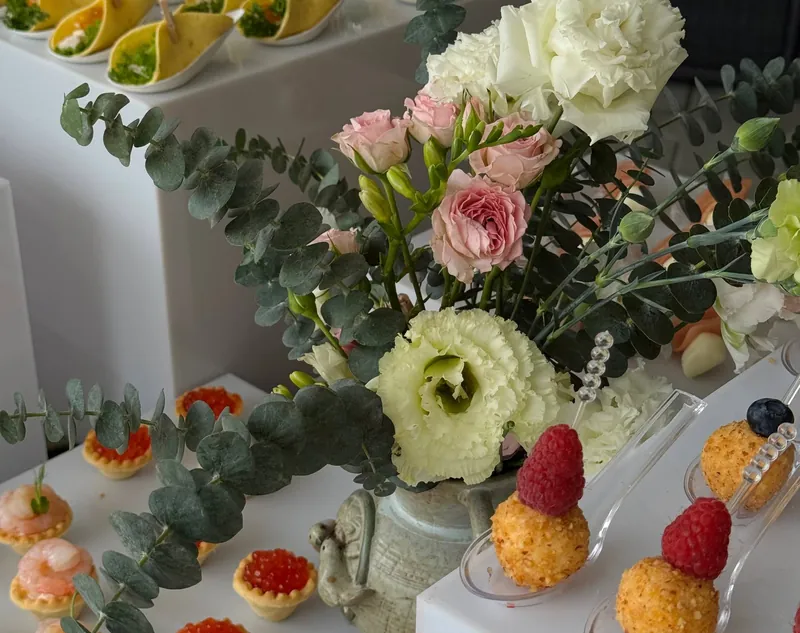

# Сайт кейтеринга «Нечай»

Статический сайт — HTML/CSS/JS без сборки.

**Сайт:** https://nechay.online/
**Репозиторий:** https://github.com/StepanCEO/nechay-catering

## Как обновить сайт

Правишь файлы, потом:

```bash
git add -A && git commit -m "что поменял" && git push
```

Дальше всё само: GitHub Actions заливает изменения по FTP на Timeweb.
Смотреть ход можно во вкладке **Actions** в репозитории, там же кнопка
запустить деплой вручную («Run workflow»).

### Настройка автодеплоя (один раз)

В репозитории: **Settings → Secrets and variables → Actions → New repository secret**.
Добавить четыре штуки:

| Имя | Значение |
|---|---|
| `FTP_SERVER` | `vh470.timeweb.ru` |
| `FTP_USERNAME` | логин FTP из панели |
| `FTP_PASSWORD` | пароль |
| `FTP_DIR` | путь к папке сайта, например `/nechay.ru/public_html/` |

Пароль попадает в хранилище секретов GitHub: он зашифрован, не виден
в логах и не показывается даже владельцу репозитория после сохранения.

`api/config.php` в исключениях — деплой его не трогает, настройки базы
на сервере остаются на месте.

Timeweb отдаёт статику с кэшем **на год**, поэтому у всех адресов стоит
версия — `css/style.css?v=25`, `assets/img/hero-logo.avif?v=2` и так далее.

- **поправил `style.css` или `main.js`** — подними `?v=` у них во всех
  трёх страницах (`index.html`, `social.html`, `privacy.html`)
- **заменил картинку, оставив имя файла** — подними `?v=` у картинок

Без этого браузер будет отдавать старое из кэша ещё год: именно так
случилось с логотипом Милл Фауз — файл на сервере обновился, а в браузере
остался прежний.

## Структура

```
index.html          главная страница
social.html         страница соцсетей со счётчиками
css/style.css       стили обеих страниц
js/main.js          меню, лайтбокс, анимации, форма, счётчики
assets/img/         картинки (см. ниже)
```

## Картинки

### Уже на месте

| Файл | Что | Как сделан |
|---|---|---|
| `assets/img/logo.png` | логотип | вырезан из `логотип.jpg`, белый фон убран |
| `assets/img/logo-light.png` | светлая версия логотипа | коричневый перекрашен в кремовый — для тёмного первого экрана и подвала |
| `assets/img/favicon.png` | иконка вкладки | фрагмент логотипа |
| `assets/img/chef.png` | Екатерина без фона | вырезана из `екатерина.jpg` |
| `assets/img/about.jpg` | фото в блок «О нас» | сгенерированный кадр, 1152×1280 |
| `assets/img/hero.jpg` | первый экран целиком | копия `главный.jpg` |
| `assets/img/hero-mobile.jpg` | фон первого экрана на телефоне | склейка чистых полос `hero.jpg` |

Исходники (`логотип.jpg`, `екатерина.jpg`, `пример сайта.jpg`) лежат в корне проекта.
Перед заливкой на хостинг их можно удалить — сайту они не нужны.

### Фото еды и портфолио

Все снимки — настоящие, из папки `фото/` (она в `.gitignore`, на хостинг
не уходит: там 34 МБ исходников, сайту нужны только обработанные копии).

Каждая картинка лежит в двух форматах — **AVIF и WebP**:

```html
<picture>
  <source srcset="assets/img/format-1.avif" type="image/avif">
  
</picture>
```

Браузер сам берёт AVIF, если умеет (в среднем на 17% легче), иначе WebP.
JPEG не держим — WebP понимают все актуальные браузеры.
Все 19 картинок вместе весят около 1,2 МБ, грузятся лениво.

| Что | Файлы | Размер кадра |
|---|---|---|
| Плитки «Наши форматы» | `format-1…5` | 800×633 |
| Портфолио | `portfolio/01…20` | 820×820 |
| Штучные закуски | `canape/1…6` | 420×420 |

Штучные закуски — это студийные кадры на белом, они стоят кружком
над меню (блок `.menu__canape`). Если будешь менять — нужен именно
белый фон, иначе круги перестанут читаться.

Чтобы заменить любое фото: положи исходник и пересобери оба формата
в тех же размерах. Кадрирование по центру со смещением вверх —
еда обычно в верхней половине кадра.

## Поисковики и микроразметка

- `sitemap.xml` — список страниц для Яндекса и Google
- `robots.txt` — правила обхода
- микроразметка **Schema.org LocalBusiness** в `<head>` главной: название,
  телефон, почта, регион работы, часы, основатель, ссылки на соцсети
  и пять услуг. Благодаря ей в выдаче рядом со ссылкой может показываться
  телефон и часы работы.

Проверить разметку: https://validator.schema.org/ и «Проверка структурированных
данных» в Яндекс.Вебмастере.

Подтверждение прав в Яндекс.Вебмастере — файл `yandex_b9d5d3d4e9f0e7d9.html`
в корне сайта. Удалять его нельзя: Яндекс периодически перепроверяет права,
и без файла сайт из Вебмастера выпадет.

Карту сайта стоит один раз добавить вручную в Яндекс.Вебмастере
и Google Search Console — так индексация пойдёт быстрее.

Адрес сайта прописан абсолютными ссылками в четырёх местах: `robots.txt`,
`sitemap.xml`, блок JSON-LD и og-теги обеих страниц. При смене домена
менять надо во всех четырёх.

## Яндекс.Метрика

Счётчик **112389037** подключён, работает на обеих страницах.
Номер лежит в константе `METRIKA_ID` в начале `js/main.js`.

**Цели уже отслеживаются в коде.** Чтобы они появились в отчётах,
их надо один раз создать в кабинете Метрики: «Настройка» → «Цели» →
«Добавить цель» → тип **«JavaScript-событие»**, и вписать идентификатор:

| Идентификатор | Когда срабатывает |
|---|---|
| `whatsapp_fab` | клик по зелёному кружку WhatsApp |
| `whatsapp` | клик по любой ссылке WhatsApp |
| `phone` | клик по телефону |
| `email` | клик по почте |
| `menu_open` | переход в меню на Menusa |
| `social` | переход в Instagram или Telegram |
| `form_submit` | отправка формы заявки |

Тогда будет видно не просто «зашло 40 человек», а сколько из них написали,
позвонили и открыли меню — и с какой рекламы пришли.

## Бэкенд: заявки, админка, бот

Появились две папки: `api/` — приём заявок, `admin/` — панель.
Работает на обычном виртуальном хостинге с PHP 8 и MySQL.

```
api/config.sample.php   образец настроек, копируется в config.php
api/db.php              подключение к базе, создаёт таблицу сама
api/lead.php            принимает заявку с формы
api/metrika.php         запросы к API Метрики для страницы аналитики
api/hash.php            разовая страница для хэша пароля, потом удалить
admin/index.php         панель: вход, действия над заявками, сбор данных
admin/view.php          разметка панели: заявки, аналитика, графики
admin/style.css         оформление панели
```

### 1. База данных

В панели Timeweb: «Базы данных» → «Создать». Запиши имя базы,
пользователя и пароль. Таблицу создавать не надо — она появится сама
при первой заявке.

### 2. Настройки

Скопируй `api/config.sample.php` в `api/config.php` (рядом, в той же папке)
и заполни. **`config.php` — единственный файл с паролями, в репозиторий
он не попадает.**

### 3. Пароль от админки

Обычный пароль в конфиг писать нельзя, только хэш. Для этого есть готовая
страница: открой **`твойдомен.ru/api/hash.php`**, придумай пароль, нажми
кнопку и скопируй строку в `admin_password_hash`.

Пароль никуда не отправляется и не сохраняется — страница только считает хэш.
Она сама отключится, как только увидит заполненный конфиг, но **после
настройки `api/hash.php` лучше удалить с сервера**.

### 4. Telegram-бот (необязательно)

1. Написать @BotFather → `/newbot` → получить токен
2. Написать своему боту любое сообщение
3. Узнать свой chat_id у @userinfobot
4. Вписать оба значения в `config.php`

Уведомление приходит сразу при отправке формы. Если поля пустые —
заявки просто сохраняются в базу без уведомлений.

### 5. Админка

Открывается по адресу `твойдомен.ru/admin/`. Две вкладки: **Заявки**
и **Аналитика**.

**Заявки.** Сводка сверху, фильтр по статусам, поиск по имени, телефону
и комментарию, выгрузка в CSV (открывается в Excel) и переключение статуса:
новая → в работе → успех / отказ.

Кнопка с корзиной убирает заявку не насовсем, а в **Корзину** — отдельную
вкладку. Оттуда её можно вернуть кнопкой «Восстановить» или стереть
окончательно кнопкой «Удалить навсегда», с подтверждением. Сделано так
нарочно: случайно потерять телефон клиента одним кликом невозможно.

**Аналитика.** Период 7 / 30 / 90 дней. Заявки по дням и разбивка
по форматам считаются из своей базы и работают всегда. Визиты,
посетители, отказы, глубина просмотра, время на сайте, график
посещаемости, источники, устройства, города и популярные страницы
приходят из Метрики — для них нужен токен (ниже).

### 6. Статистика Метрики в админке (необязательно)

1. Открыть https://oauth.yandex.ru/client/new и создать приложение
   с правом «Яндекс.Метрика — получение статистики».
2. Получить для него OAuth-токен.
3. Вписать токен в `metrika.token`, а номер счётчика — в `metrika.counter`.

Без токена админка работает как обычно, просто вместо цифр Метрики
показывает короткую инструкцию. Ответы API кэшируются на 10 минут,
чтобы не дёргать Яндекс на каждое обновление страницы.

**Цели** показываются, если вписать их в `metrika.goals` — номер цели
из кабинета Метрики и название для админки:

```php
'goals' => [12345 => 'Заявка с формы', 12346 => 'Клик по WhatsApp'],
```

### Что важно знать

- Форма отправляет заявку на `/api/lead.php` и показывает «Заявка
  отправлена». WhatsApp при этом не открывается — для него есть
  отдельная кнопка и ссылки в контактах.
- Если бэкенда нет (например, сайт лежит на GitHub Pages) — запрос
  не проходит, человек видит сообщение с телефоном для связи.
  Сайт не ломается.
- Заявки из корзины удаляются из базы окончательно. Прежде чем чистить
  корзину, стоит выгрузить заявки в CSV.
- В базе лежат персональные данные: имена и телефоны. Пароль от админки
  должен быть длинным, а `config.php` — никогда не попадать в репозиторий.

## Политика и согласие

`privacy.html` — политика обработки персональных данных. Форма собирает имя
и телефон и складывает их в базу, поэтому политика нужна: раньше под кнопкой
было написано «соглашаетесь на обработку», а самого документа не существовало.

В форме теперь обязательная галочка со ссылкой на политику: без неё заявка
не отправляется. Ссылка на документ есть в подвале всех страниц.

> **Осталось заполнить.** В разделе 1 стоит заглушка
> `ИП Нечаева Екатерина, ИНН —`. Нужно вписать точное название и ИНН,
> они помечены в разметке атрибутом `data-fill`.
> Юрист документ не проверял — это стандартный образец, адаптированный
> под то, что сайт действительно собирает.

## Частые вопросы

Шесть вопросов перед блоком контактов на `<details>`, без скриптов,
плюс микроразметка `FAQPage`. Тексты ответов согласованы с заказчиком.

При правке ответа **нужно менять его в двух местах**: в разметке секции
и в блоке `application/ld+json` в `<head>` — иначе поисковик покажет
в выдаче старую версию.

## Портфолио с фильтром

20 снимков, разложены по четырём разделам через `data-cat` у каждой плитки:
`furshet`, `banket`, `dostavka`, `vyezd`. Кнопки фильтра — `.portfolio__filter`,
логика в `js/main.js`.

Сразу показываются 8 плиток, остальные открываются кнопкой «Показать ещё».
Если раздел меньше восьми — кнопка скрывается сама.

Чтобы добавить снимок: положи `NN.avif` и `NN.webp` в `assets/img/portfolio/`
и добавь плитку в разметку с нужным `data-cat`. Сетка ровная, все кадры
квадратные 820×820 — вытянутых плиток больше нет, иначе при фильтрации
в сетке оставались бы дыры.

## Блок «О нас»

Слот под фото задан как `aspect-ratio: 9/10` в `css/style.css` — ровно под
текущий кадр 1152×1280, поэтому ничего не обрезается. Если будешь менять фото,
либо готовь его в тех же пропорциях (например 1600×1778), либо поправь
`aspect-ratio` под новый размер — иначе `object-fit: cover` срежет края.

Плашка «120+ мероприятий» лежит поверх снимка в левом нижнем углу,
так что этот угол лучше держать свободным от важных деталей.

## Первый экран

Фон — фотография зала (`hero-scene.*`), логотип — картинка (`hero-logo.*`),
надписи и кнопка — живой текст. Фигуры на баннере больше нет.

Логотип рисуется с уменьшением (1118 px исходник, 460 px на экране 1440),
поэтому остаётся чётким при любом разрешении. Растягивать баннер целиком
одной картинкой нельзя — так вшитые надписи мылят на широких мониторах,
через это уже проходили.

Поверх фона лежит мягкая световая подсветка по центру
(`.hero__scene::after`) — без неё тёмный текст тонет на пёстром кадре.

## Что нужно заменить в тексте

Тексты «О нас», форматы, подводка к меню, цифры и список клиентов взяты
из «инфа сайт.docx» — это реальные данные.

Осталось условным только одно: **отзывов нет**. Раздел с придуманными
отзывами я убрал — публиковать выдуманные отзывы от несуществующих людей
на живом сайте нельзя. На его месте теперь блок «Наши клиенты».
Пришлёшь настоящие отзывы — верну раздел.

Телефон, почта и WhatsApp настоящие: **+7 (962) 490-84-83**,
**ekaterina-nechaeva@bk.ru**.
`wa.me/79624908483` стоит в зелёной кнопке, в блоке «Контакты» и в константе
`WHATSAPP_NUMBER` в `js/main.js` (туда уходит заявка из формы).

## Кнопка WhatsApp

Зелёный кружок закреплён в правом нижнем углу на обеих страницах,
слегка пульсирует и на наведении раскрывается в «Заказать в WhatsApp».
На телефоне остаётся кружком, чтобы не перекрывать текст.
Разметка — блок `.wa-fab` перед `<script>` в конце `index.html` и `social.html`.

## Логотипы клиентов

Лежат в `assets/img/clients/`, показываются в цвете. Знаки разной формы —
широкие словесные и компактные марки — поэтому в CSS у них три размерных
класса, иначе ряд скачет по высоте: `.clients__logo` (по умолчанию),
`--wide` для Samsung и `--mark` для квадратных знаков.

| Клиент | Файл | Откуда | Лицензия |
|---|---|---|---|
| РЖД | `rzd.svg` | Wikimedia Commons, `Russian Railways Logo.svg` | Public domain |
| Сбербанк | `sberbank.png` | прислан заказчиком | знак компании |
| МСП Банк | `mspbank.png` | прислан заказчиком | знак компании |
| Samsung | `samsung.svg` | Wikimedia Commons, `Samsung wordmark.svg` | Public domain |
| Милл Фауз | `millfauz.png` | millfauz.ru | знак компании |
| «Новотерская целебная» | `novoterskaya.png` | novoterskaya.ru (знак КМВ) | знак компании |

У присланных файлов была непрозрачная светлая подложка — она бы читалась
серым прямоугольником на белой плитке, поэтому фон вырезан по цвету угла,
края растушёваны. Исходники `logo-sber.png` и `images.png` лежат в корне
проекта и не выкладываются на хостинг (см. `.gitignore`).

> **Важно про товарные знаки.** РЖД, Сбербанк, Samsung — зарегистрированные
> марки, их бренд-гайдлайны обычно требуют согласовывать размещение на чужих
> сайтах. Практика «стены клиентов» распространена, но письменное разрешение
> от компаний лучше получить.

## Мобильная версия

Первый экран на телефоне собирается заново, а не масштабирует баннер:
надписи на `hero.jpg` в ширину 390px нечитаемы. Слои — фон, вырезанная
Екатерина и живой текст с настоящей кнопкой (блок `.hero__mobile`).
Десктоп по-прежнему показывает готовый баннер.

Фон `assets/img/hero-mobile.avif` / `.webp` — кадр банкетного зала из её
съёмки, размытый и притемнённый, чтобы белый китель и текст читались.
Раньше он был склеен из полос старого баннера и заметно мылил:
сверху люстры и боке (`y 0–150`), снизу накрытый стол (`y 500–720`),
оба куска взяты правее шефа (`x 660–1280`) и сшиты мягким переходом.
Если баннер поменяется — пересобрать фон из новых координат.

Преимущества уезжают на тёмную скруглённую плашку в четыре колонки,
а «Наши форматы» превращаются в карусель: две строки, листается пальцем,
под ней точки. Карточки в такой сетке заполняются по столбцам, поэтому
порядок переставлен через `order` — иначе пары читались бы сверху вниз.
Количество точек считает `js/main.js` по числу карточек.

## Меню

Раздел «Меню» на сайте — витрина с основными позициями и ценами.
Кнопка «Открыть полное меню» ведёт на Menusa:
https://menusa.app/11ef7fbb8e6bce53bec017064314d17f

Если цены на Menusa поменяются, поправить их и в `index.html` (блок `<section class="menu">`).

## Страница соцсетей

`social.html` — отдельная страница, кнопка «Соцсети» ведёт на неё из меню в шапке
и из подвала на обеих страницах.

### Аккаунты

| Карточка | Ссылка | Подписчиков |
|---|---|---|
| Instagram · кейтеринг | https://www.instagram.com/nechai.catering | 1 215 |
| Instagram · личный блог | https://www.instagram.com/kety_nechaeva | 10 200 |
| Telegram · канал | https://t.me/VkusLifeNechaeva | 400 |

Суммарно — 11 815, эта цифра стоит в шапке страницы.
YouTube убран; заготовка стиля `.social-card--yt` в `css/style.css` осталась
на случай, если канал появится.

### Счётчики

Число задаётся атрибутом `data-count` — правится прямо в `social.html`,
трогать скрипты не нужно:

```html
<span class="counter" data-count="10200">0</span>
```

Разряды сами разделяются пробелом (`10 200`). Необязательный `data-suffix`
дописывается справа — так сделано «98%»:

```html
<span class="counter" data-count="98" data-suffix="%">0</span>
```

Суммарное число в шапке считается не автоматически — при смене цифр
пересчитай его вручную (сейчас `data-count="11815"`).

Счётчик стартует не при загрузке, а когда блок появляется в поле зрения:
цифра быстро добегает до значения с плавным торможением, под ней заполняется
тонкая полоска. У кого в системе включено «уменьшить движение» — число
показывается сразу. Если вкладку свернули на середине анимации, счётчик
всё равно доходит до конечного числа.

Блок «В цифрах» (событий, лет, позиций в меню, возвращаются снова) работает
так же — цифры там тоже условные, замени на реальные.

## Форма заявки

Бэкенда нет: форма проверяет имя и телефон и открывает WhatsApp с готовым текстом заявки.
Если нужна отправка на почту или в Telegram-бота — это отдельная доработка.
